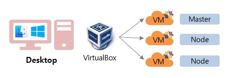
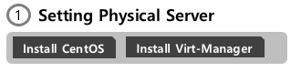
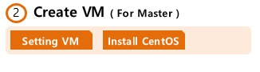
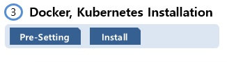
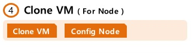
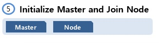

바로가기 : 
<https://www.inflearn.com/course/%EC%BF%A0%EB%B2%84%EB%84%A4%ED%8B%B0%EC%8A%A4-%EA%B8%B0%EC%B4%88#>

# 7-2. Appendix. Kubernetes Installation - Case 2


<br/>
윈도우나 맥이 설치되어 있는 Desktop가 1대 있고, 그위에 VirtualBox와 같은 도구를 이용해서 VM을 만드는 경우
<br/>
<br/>
(아직 작성중입니다)
<br/>



## 1-1) Install CentOS

<details><summary>show</summary>
<p>
   

### 1-1-1) CentOS 다운로드

아래 경로에서 Minimal ISO 로 들어가서 원하는 경로에서 파일 다운로드
<br/>
>https://www.centos.org/download/


### 1-1-2) Booting USB 만들기

아래 경로로 들어가면 중간 정도에 다운로드 버튼 있어요. 
<br/>
>https://rufus.ie/ko_KR.html
<br/>
다운로드 후 실행

```sh 
- 장치 : USB 선택
- 부트 선택 : 디스크 또는 ISO 이미지 [선택] 클릭 후 다운받은 파일 지정
- [시작]
``` 

### 1-1-3) CentOS 설치

USB를 설치할 서버에 꼽고 부팅하면 CentOS 설치단계로 가져요.
<br/>
안되시는 분은 부팅 순서를 USB가  변경하셔야 됩니다.
<br/>
4번 단계에서 `8.8.8.8`는 Google DNS입니다. 원하는 DNS 쓰셔도 되요.

```sh
1. Test this media & install CentOS 7
2. Language : 한국어 
3. Disk 설정 [시스템 > 설치 대상]
   - [기타 저장소 옵션 > 파티션 설정] 파티션을 설정합니다. [체크] 후 [완료]
   - 기존에 파티션이 설정되어 있으면 하나씩 선택해서 [-] 버튼으로 삭제
   - 새로운 CentOS 설치 > 여기를 클릭하여 자동으로 생성합니다. [클릭]
   - /home [클릭] 후 용량 30 GiB로 변경 [설정 업데이트 클릭]
   - / [클릭] 후 /home에서 뺀 GiB 만큼 추가해서 GiB 수정 후 [설정 업데이트 클릭]
   - [완료], [변경 사항 적용]
4. 네트워크 설정 [시스템 > 네트워크 및 호스트명 설정]
   - 호스트 이름: physical-host [적용]
   - 이더넷 [켬], [설정], [IPv4 설정] 탭
   - 방식: 수동으로 선택, 
   - [Add] -> 주소: 192.168.0.20, 넷마스크 : 255.255.255.0, 게이트웨이: 192.168.0.1, DNS 서버 : 8.8.8.8 [저장][완료]
5. 설치시작
6. [설정 > 사용자 설정] ROOT 암호 설정 
7. 설치 완료 후 [재부팅]
   (재부팅 시에는 USB 빼는거 잊지 마세요)
```

</p>
</details>


## 1-2) Install Virt-Manager


<details><summary>show</summary>
<p>

### 1-2-1) 원격접속 툴 MobaXterm 설치

Virt-Manager의 UI 툴을 띄우기 위해서 MobaXterm 원격접속 툴을 사용하셔야 되요

>https://mobaxterm.mobatek.net/

```sh
- [GET MOBAXTERM NOW] 버튼 클릭
- Free 버전 [Download now]
- Installer editon 다운로드 및 실행
- Sessions > SSH > Remote host : 192.168.0.20 > [Bookmark settings] Session name : host-192.168.0.20 > [ok]
- Sessions > SSH > Remote host : 192.168.0.30 > [Bookmark settings] Session name : master-192.168.0.30 > [ok]
- Sessions > SSH > Remote host : 192.168.0.31 > [Bookmark settings] Session name : node1-192.168.0.31 > [ok]
- Sessions > SSH > Remote host : 192.168.0.32 > [Bookmark settings] Session name : node2-192.168.0.32 > [ok]
```


### 1-2-2) Virt-Manager 설치

아래 경로에 Virt-Manager 설치에 대해서 잘 정리되어 있어요.
<br/>
>https://www.linuxtechi.com/install-kvm-hypervisor-on-centos-7-and-rhel-7/
<br/>

현재 서버가 가상화 가능한 서버인지 확인
```sh
grep -E '(vmx|svm)' /proc/cpuinfo
```
실행 결과에 vmx 나 svm이 나오면 됩니다.

<br/>
설치 후 yum update는 기본

```sh
yum update 
```

virt-manager 패키지 
```sh
yum install qemu-kvm qemu-img virt-manager libvirt libvirt-python libvirt-client virt-install virt-viewer bridge-utils   
```

virt-manager 구동
```sh
systemctl start libvirtd && systemctl enable libvirtd
```

virt-manager UI를 띄우기 위해 X Window System 및 폰트 설치
```sh
yum groupinstall "X Window System" "Fonts"
```

virt-manager 실행 
<br/>
만약 UI가 뜨지 않으면 재접속 후 다시 실행
```sh
virt-manager
```

</p>
</details>

<br/>
<br/>



## 2-1) Setting VM

<details><summary>show</summary>
<p>


### 2-1-1) CentOS 최신버전 다운로드
Virt-Manager의 Image 파일 기본 경로로 이동

```sh
cd /var/lib/libvirt/images
```
Minimal ISO 버전 다운로드 
<br/>
만약 다운로드 받은 파일 크기가 매우 작다면 해당 경로에 파일이 없는 것이니, 아래 URL에서 [Minimal ISO]를 선택하고 원하는 경로로 변경하세요.
<br/>
>https://www.centos.org/download/

```sh
curl -O http://mirror.kakao.com/centos/7.7.1908/isos/x86_64/CentOS-7-x86_64-Minimal-1908.iso 
```

파일 크기 확인

```sh
ls -al 
```

### 2-1-2) Virt-Manager UI 설정
UI 실행 명령

```sh
virt-manager
```

6번 단계에서 `Host divice eno1`는 자신 서버에 물리 Port가 여러게 있을 경우, Port 갯수 만큼 생성되는데 선택한 Port로 해당 VM의 트래픽이 나가기 때문에 여러 VM을 만들때 분산해서 지정하면 좋아요

```sh
1. 파일 > 새 가상 머신
2. [1단계] 로컬 설치 매체(ISO 이미지나 CDROM)선택 
3. [2단계] ISO 이미지 사용 [검색] 클릭해서 ISO 선택 
4. [3단계] 메모리(RAM) : 4096 MiB, CPU들 2로 변경 
5. [4단계] 150 GiB 변경 
6. [5단계] 이름 : k8s-master, 네트워크 선택을 [호스트 장치 enp2s0:macvtap] 선택 후 소스 모드는 [브릿지]확인
7. [완료]를 누르고 조금 기다리면 CentOS 설치 화면 나옴
```

</p>
</details>

## 2-2) Install CentOS

<details><summary>show</summary>
<p>

### 2-2-1) CentOS 설치

4번 단계에서 `8.8.8.8`는 Google DNS입니다. 원하는 DNS 쓰셔도 되요.

```sh
1. Test this media & install CentOS 7
2. Language : 한국어 
3. Disk 설정 [시스템 > 설치 대상]
   - [기타 저장소 옵션 > 파티션 설정] 파티션을 설정합니다. [체크] 후 [완료]
   - 새로운 CentOS 설치 > 여기를 클릭하여 자동으로 생성합니다. [클릭]
   - /home [클릭] 후 용량 5.12 GiB로 변경 [설정 업데이트 클릭]
   - / [클릭] 후 140 GiB 변경 후 [설정 업데이트 클릭]
   - [완료], [변경 사항 적용]
4. 네트워크 설정 [시스템 > 네트워크 및 호스트명 설정]
   - 호스트 이름: k8s-master [적용]
   - 이더넷 [켬], [설정], [IPv4 설정] 탭
   - 방식: 수동으로 선택, 
   - [Add] -> 주소: 192.168.0.30, 넷마스크 : 255.255.255.0, 게이트웨이: 192.168.0.1, DNS 서버 : 8.8.8.8 [저장][완료]
5. 설치시작
6. [설정 > 사용자 설정] ROOT 암호 설정 
7. 설치 완료 후 [재부팅]
```

</p>
</details>

<br/>
<br/>



## 3-1) Pre-Setting


<details><summary>show</summary>
<p>

### 3-1-1) SELinux 설정


Ubuntu나 Debian등 다른 OS를 설치하시는 분들께서는 아래 경로에서 명령어 참고 바래요
<br/>
https://kubernetes.io/docs/setup/production-environment/tools/kubeadm/install-kubeadm/
<br/>
https://kubernetes.io/docs/setup/production-environment/container-runtimes/#docker
<br/>
쿠버네티스가 Pod Network에 필요한 호스트 파일 시스템에 액세스가 가능하도록 하기 위해서 필요한 설정이예요
<br/>
아래 설정으로 SELinux을 permissive로 변경해야하고 

```sh
setenforce 0
```
리부팅시 다시 원복되기 때문에 아래 명령을 통해서 영구적으로 변경 해야되요

```sh
sed -i 's/^SELINUX=enforcing$/SELINUX=permissive/' /etc/selinux/config
```

아래 명령어를 실행해서 `Current mode:permissive` 내용 확인

```sh
sestatus
```


### 3-1-2) 방화벽 해제

firewalld 비활성화

```sh
systemctl stop firewalld && systemctl disable firewalld
```

NetworkManager 비활성화

```sh
systemctl stop NetworkManager && systemctl disable NetworkManager
```

### 3-1-3) Swap 비활성화
Swap 사용에 관련해서는 많은 의견이 있어요.
<br/>
>https://github.com/kubernetes/kubernetes/issues/53533
<br/>
위 내용을 참고하셔서 swap 사용시의 고려해야할 점을 확인하시고 일단 여기선 사용하지 않도록 설정할께요.

```sh
swapoff -a && sed -i '/ swap / s/^/#/' /etc/fstab
```

### 3-1-4) iptables 커널 옵션 활성화
RHEL이나 CentOS7 사용시 iptables가 무시되서 트래픽이 잘못 라우팅되는 문제가 발생한다고 하여 아래 설정이 추가되요

```sh
cat <<EOF >  /etc/sysctl.d/k8s.conf
net.bridge.bridge-nf-call-ip6tables = 1
net.bridge.bridge-nf-call-iptables = 1
EOF
sysctl --system
```

### 3-1-5) 쿠버네티스 YUM Repository 설정

YUM에 대해서 좀더 상세한 내용이 궁금한 분께서는 아래 싸이트가 잘 정리되어 있는거 같아 링크 첨부했어요.
<br/>
>https://www.lesstif.com/display/1STB/yum

```sh
cat <<EOF > /etc/yum.repos.d/kubernetes.repo
[kubernetes]
name=Kubernetes
baseurl=https://packages.cloud.google.com/yum/repos/kubernetes-el7-x86_64
enabled=1
gpgcheck=1
repo_gpgcheck=1
gpgkey=https://packages.cloud.google.com/yum/doc/yum-key.gpg https://packages.cloud.google.com/yum/doc/rpm-package-key.gpg
EOF
```

### 3-1-6) Centos Update

```sh
yum update
```

### 3-1-7) hosts 등록
계획된 master와 node의 호스트 이름과 IP를 모두 등록해주세요. 안하시면 추후 kubeadm init시 Host이름으로 IP를 찾을 수 없다고 에러가 나요.

```sh
cat << EOF >> /etc/hosts
192.168.0.30 k8s-master
192.168.0.31 k8s-node1
192.168.0.32 k8s-node2
EOF
```


</p>
</details>

## 3-2) Install 

<details><summary>show</summary>
<p>

### 3-2-1) Docker 설치 

도커 설치 전에 필요한 패키지 설치 

```sh
yum install -y yum-utils device-mapper-persistent-data lvm2 
```

 도커 설치를 위한 저장소 를 설정 

```sh
yum-config-manager --add-repo https://download.docker.com/linux/centos/docker-ce.repo
```

도커 패키지 설치 

```sh
yum update && yum install docker-ce-18.06.2.ce
```

```sh
mkdir /etc/docker
cat > /etc/docker/daemon.json <<EOF
{
  "exec-opts": ["native.cgroupdriver=systemd"],
  "log-driver": "json-file",
  "log-opts": {
    "max-size": "100m"
  },
  "storage-driver": "overlay2",
  "storage-opts": [
    "overlay2.override_kernel_check=true"
  ]
}
EOF

mkdir -p /etc/systemd/system/docker.service.d
```

### 3-2-2) Kubernetes 설치

```sh
yum install -y kubelet kubeadm kubectl --disableexcludes=kubernetes
```

</p>
</details>


<br/>
<br/>



## 4-1) Clone VM


<details><summary>show</summary>
<p>

### 4-1-1) 시스템 shutdown

여기까지 만든 이미지를 복사해 놓기 위해서 Master를 잠시 Shutdown 시켜요.

```sh
shutdown now
```

### 4-1-2) VM 복사

Physical Server(192.168.0.30)에서 virt-clone 명령을 통해 VM을 복제하세요.
<br/>
Node1 VM 생성

```sh
virt-clone -o k8s-master -n k8s-node1 --auto-clone
```

</p>
</details>

## 4-2) Config Node

<details><summary>show</summary>
<p>
### 4-2-1) Network 변경하기
Host의 Ip Address를 변경하기 위해 아래 명령어로 설정을 열고

```sh
vi /etc/sysconfig/network-scripts/ifcfg-eth0
```
`IPADDR=` 부분을 해당 Node의 IP (192.168.0.31)로 변경해주세요

```sh
...
DEVICE="etho0"
ONBOOT="yes"
IPADDR="192.168.0.31"
...
```

그리고 아래 명령어로 네트워크 재시작

```sh
systemctl restart network
```

### 4-2-2) Host Name 변경
해당 Node의 Host 이름을 변경해주세요

```sh
hostnamectl set-hostname k8s-node1
```

이와 같은 방식으로 k8s-node2(192.168.0.32) 도 새 VM을 만듭니다.

</p>
</details>

<br/>
<br/>



## 5-1) Master

<details><summary>show</summary>
<p>

### 5-1-1) 도커 및 쿠버네티스 실행
도커 실행

```sh
systemctl daemon-reload
```

```sh
systemctl enable --now docker
```

아래 명령어를 입력하면 image를 다운받는 내용이 나오면서 중간에  `Hello for Docker!` 가 보이면 설치 확인되면 설치가 잘 된거예요.

```sh
docker run hello-world
```

쿠버네티스 실행

```sh
systemctl enable --now kubelet
```


### 5-1-2) 쿠버네티스 초기화 명령 실행

kubeadm init 명령관련 해서 상세 내용이 궁금하신 분은 아래 싸이트 참고하세요.
>https://kubernetes.io/docs/reference/setup-tools/kubeadm/kubeadm-init/
<br/>
`pod-network-cidr` 를 설정하면 Pod의 IP가 자동으로 생성될때 해당 network으로 생성되요


```sh
kubeadm init --pod-network-cidr=20.96.0.0/12
```

실행 후 `[Your Kubernetes master has initialized successfully!]` 문구를 확인하고 아래 내용 복사해서 별도로 저장해 둡니다. 
<br/>
kubeadm join 192.168.0.30:6443 --token ki4szr.t3wondaclij6d1a3 \
    --discovery-token-ca-cert-hash sha256:2370f0451342c6e4bd0d38f6c2511bda5c50374c85e9c09da28e12dd666d5987
    
### 5-1-3) 환경변수 설정
root 계정을 이용해서 kubectl을 실행하기 위한 환경 변수를 설정

```sh
mkdir -p $HOME/.kube
sudo cp -i /etc/kubernetes/admin.conf $HOME/.kube/config
sudo chown $(id -u):$(id -g) $HOME/.kube/config
```

### 5-1-4) kubectl 자동완성 기능 설치
kubectl 사용시 [tab] 버튼을 이용해서 다음에 올 명령어 리스트를 조회 할 수 있어요.
<br/>
명령 실행 후 바로 적용이 안되기 때문에 접속을 끊고 다시 연결 후에 사용 가능합니다. 

```sh
yum install bash-completion -y
source <(kubectl completion bash)
echo "source <(kubectl completion bash)" >> ~/.bashrc
```

</p>
</details>


## 5-2) Node

<details><summary>show</summary>
<p>

### 5-2-1) 도커 및 쿠버네티스 실행

도커 실행

```sh
systemctl daemon-reload
```

```sh
systemctl enable --now docker
```

쿠버네티스 실행

```sh
systemctl enable --now kubelet
```

### 5-2-2) Node 연결
Master Init 후 복사 했었던 내용 붙여넣기

```sh
kubeadm join 192.168.0.30:6443 --token 7xd747.bfouwf64kz437sqs \
    --discovery-token-ca-cert-hash sha256:ec75641cd258f2930a7f73abfe540bb484eb295ad4500ccdaa166208f97c5117
```

### 5-2-3) Node 연결 확인
Master 서버에 접속해서 아래 명령 입력 후 추가된 Node가 보이는지 확인 (Status는 NotReady)

```sh
kubectl get nodes
```

</p>
</details>

<br/>
<br/>


## 6-1) Networking

<details><summary>show</summary>
<p>


### 6-1-1) Calico 설치

Kubernetes Cluster Networking에는 많은 Plugin들이 있는데 그중 Calico 설치에 대한 내용 입니다.
<br/>
>https://docs.projectcalico.org/v3.9/getting-started/kubernetes/
<br/>
Calico는 기본 192.168.0.0/16 대역으로 설치가 되는데, 그럼  실제 VM이 사용하고 있는 대역대와 겹치기 때문에 수정을 해서 설치해야 할 경우

```sh
curl -O https://docs.projectcalico.org/v3.9/manifests/calico.yaml
sed s/192.168.0.0\\/16/20.96.0.0\\/12/g -i calico.yaml
kubectl apply -f calico.yaml
```

calico와 coredns 관련 Pod의 Status가 Running인지 확인 

```sh
kubectl get pods --all-namespaces
```

</p>
</details>

## 6-2) Dashboard


<details><summary>show</summary>
<p>

### 6-2-1) Dashboard 설치 

v2.0.0-beta4 버전을 설치합니다. 해당 설정은 교육목적으로 권한 설정을 모두 해제하는 방법이기 때문에 프로젝트에서 사용하실때는 이점 유의바래요
<br/>
>https://kubernetes.io/docs/tasks/access-application-cluster/web-ui-dashboard/


```sh
kubectl apply -f https://raw.githubusercontent.com/kubernetes/dashboard/v2.0.0-beta4/aio/deploy/recommended.yaml
```

### 6-2-2) 권한 해지 설정 

접속시 인증 Skip 설정
<br/>
아래 명령을 통해 수정 모드로 들어가서

```sh
kubectl -n kubernetes-dashboard edit deployments.apps kubernetes-dashboard
```

 아래 내용 찾아서 `--enable-skip-login` 추가 

```sh
-------------------------------
    spec:
      containers:
      - args:
        - --auto-generate-certificates
        - --enable-skip-login
-------------------------------
```

Dashboard의 ClusterRole 내용을 지우고

```sh
cat <<EOF | kubectl delete -f -
kind: ClusterRole
apiVersion: rbac.authorization.k8s.io/v1
metadata:
  name: kubernetes-dashboard
EOF	
```

모든 권한으로 리소스에 접근할 수 있도록 ClusterRole 새로 추가

```sh
cat <<EOF | kubectl create -f -
kind: ClusterRole
apiVersion: rbac.authorization.k8s.io/v1
metadata:
  labels:
    k8s-app: kubernetes-dashboard
  name: kubernetes-dashboard
rules:
  - apiGroups: ["*"]
    resources: ["*"]
    verbs: ["*"]
EOF	
```


### 6-2-3) 백그라운드로 proxy 띄우기	
`--address`에 자신의 Host IP 입력 

```sh
nohup kubectl proxy --port=8001 --address=192.168.0.30 --accept-hosts='^*$' >/dev/null 2>&1 &
```

### 6-2-4) 접속 URL 

```sh
http://192.168.0.30:8001/api/v1/namespaces/kubernetes-dashboard/services/https:kubernetes-dashboard:/proxy/.
```

</p>
</details>
