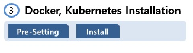

바로가기 : 
<https://www.inflearn.com/course/%EC%BF%A0%EB%B2%84%EB%84%A4%ED%8B%B0%EC%8A%A4-%EA%B8%B0%EC%B4%88#>

# 7-1. Appendix. Kubernetes Installation - Case 3


<br/>
구글 클라우드 플랫폼을 이용해서 VM을 만드는 경우
<br/>
<br/>
<br/>


## 1-1) GCP Join

<details><summary>show</summary>
<p>


### 1-1-1) Join

아래 사이트에 들어가서 상단에 [무료로 시작하기] 버튼 클릭
<br/>
>https://cloud.google.com/

<br/>

```sh
1) Country : South Korea
2) Terms of Service : 체크 후 [CONTINUE]
3) 이름 및 주소 확인 후 Payment method 입력
```
</p>
</details>

<br/>
<br/>


## 2-1) Setting Cluster

<details><summary>show</summary>
<p>


### 2-1-1) Cluster 생성

Kubernetes Engine > Clusters > [CREATE CLUSTER] 클릭

```sh
1. Name : k8s-cluster
2. Location Type : Zonal
3. Zone : asia-east1-a 부터 asia-east2-c 중 하나 선택
4. Master Version : 1.14.8-gke.2
5. Node pools > default-pool > Number of nodes : 2
6. Machine type : n1-standard-2 (2 vCPU, 7.5GB memory)
7. [Create] 클릭
```


### 2-1-2) Local PC에 GCP 연결
아래 URL에서 Windows용 GCP SDK 설치
<br/>

>https://cloud.google.com/sdk/docs/quickstart-windows

<br/>

다른 운영체제에서는 아래 내용 참조
<br/>

>https://cloud.google.com/sdk

```sh
1. [Google Cloud SDK 설치 프로그램] 다운로드
2. Next > Next 를 통해 설치 후 마지막에 4가지 체크항목 모두 선택 후 [Finish]
```
<br/>
바탕화면에 설치된 [Google Cloud SDK Shell] 실행하면 아래 내용을 물어봅니다.

```sh
1. Choose Account : 1 (자신의 google id 선택)
2. Pic cloud project : 2 (자신의 Project 선택, GCP > Home > Dashboard > Project info > Project ID 에서 확인 가능)
3. Configure Region/Zone : Y, 46 (자신의 zone 선택, asia-east2-c 기준 46)
```

<br/>
gcloud 업그레이드 및 kubectl 설치

```sh
gcloud components update
```

```sh
gcloud components install kubectl
```

<br/>
GCP > Kubernetes Engine > Clusters > k8s-cluster 리스트에 [Connect] 버튼 클릭하여 나오는 팝업에서 아래 내용 복사
<br/>
`gcloud container clusters get-credentials k8s-cluster --zone asia-east2-c --project turnkey-conduit-258023`

<br/>

Local GCP Shell에 붙여 놓기를 한 후 아래 명령어로 확인

```sh
kubectl get nodes
```


</p>
</details>

<br/>
<br/>




